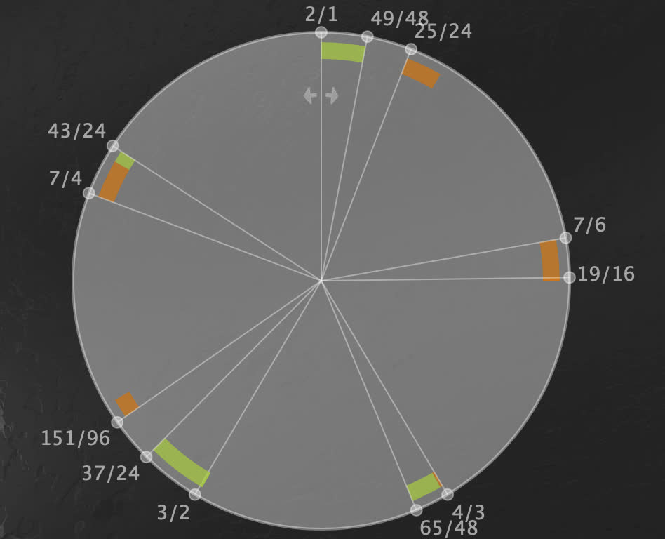

#+TITLE: Paisaje Difractado No.1
#+AUTHOR: vid.eco

* Introducción
Esta pieza está basada en algunos hallazgos en mis investigación sobre las afinaciones de Erv Wilson. Durante este semestre desarrollé una serie de funciones y una [[https://wilson-tunings.echoic.space/beating-analyzer][aplicación web]] ([[https://github.com/diegovdc/erv-web/tree/main/src/wilson_tunings/beating_analyzer()][código fuente]])  para analizar una afinación en términos de los batimentos que se producen entre los armónicos de dos pares de notas pertenecientes a su escala.

La idea de analizar las afinaciones de esta manera se deriva de una idea de [[https://www.anaphoria.com/wilsonintroMERU.html][Kraig Grady en su introducción]] a la teoría de las escalas /Meru/ de Wilson.
#+begin_quote
It is worth highlighting the properties that make these scales unique. Harmonically, they have the property of forming a series of proportional (or equal-beating) triads that in turn generate difference tones that occur in the scale or its seed. Thus, these scales are constantly reinforcing themselves, making a self-contained acoustical and perceivable structure. The proportional triad is found in the sum triplet by placing the top tone in between the two numbers we used to generate it. 
#+end_quote

La aplicación desarrollada permite analizar y verificar esta idea a la vez que genera más datos en relación con estas escalas (o cualquier otra de afinación justa).

La pieza que se ha desarrollado aquí, agrupa los diferentes pares de frecuencias que producen batimentos para generar secuencias de los mismos dentro de un entorno de /live coding/.

* Dependencias

Con excepción de =overtone= (que funciona como interfaz al servidor de audio de =SuperCollider=) todas las liberías usadas en esta pieza han sido desarrolladas por mi.

Entre ellas destacan:
- [[https://github.com/diegovdc/erv/blob/js-rationals/src/erv/beating_analyzer/v1.cljc][erv.beating-analyzer.v1]] que provee el función para el análisis de los batimentos.
- [[https://github.com/diegovdc/time-time/blob/main/src/time_time/dynacan/players/refrain/v2.cljc][time-time.dynacan.players.refrain.v2]] que provee principalmente el secuenciador de eventos =ref-rain= y la =macro= =on-event=.
- [[https://github.com/diegovdc/tiempaminos/blob/dev/src/tieminos/seq_utils/core.clj][tieminos.seq-utils.core]] que provee el secuenciador de datos =rainseq=.

  Ambos secuenciadores están inspirados en la librería de patrones de =SuperCollider= y en =TidalCycles=  conjuntamente las funcionalidades un secuenciador híbrido, que tiene como principal propósito, proveer un control fino y generalizado de los eventos mediante el uso de funciones de segundo orden (gracias a la macro =on-event=). 

#+begin_src clojure
(ns tieminos.compositions.paisajes-difractados.uno
  (:require
   [erv.beating-analyzer.v1 :refer [get-beat-data]]
   [overtone.core :as o]
   [tieminos.overtone-extensions :as oe]
   [tieminos.sc-utils.synths.v1 :refer [lfo-kr]]
   [tieminos.seq-utils.core :refer [** ++ lin rainseq]]
   [tieminos.utils :refer [rrange wrap-at]]
   [time-time.dynacan.players.refrain.v2 :as rain.v2 :refer [on-event ref-rain]]))
#+end_src

#+begin_src clojure :exports none
(in-ns 'tieminos.compositions.paisajes-difractados.uno)
#+end_src

* Afinación
Usamos la escala =Meta-slendro= en la versión de Kraig Grady.
#+begin_src clojure
(def metaslendro
  [49/48 25/24 7/6 19/16 4/3 65/48 3/2 37/24 151/96 7/4 43/24 2/1])
#+end_src

Esta escala es una especie de pentatónica con "micro-clusters" en cada uno de sus cinco tonos.
   

** Análisis
Para analizar la escala usamos =get-beat-data=. Esta función tiene tres argumentos, =periodo frecuencia-fundamental armónicos-por-analizar=. El periodo es =2= puesto que =meta-slendro= se repite a la octava; usamos una frecuencia fundamental de 1hz y analizamos hasta el armónico 13, saltándonos algunos de los números pares de las octavas superiores del espectro.

Usamos la función =+avg-freq= para poder filtrar aquellos batimentos que suceden en frecuencias menores a 60hz
#+begin_src clojure 
(defn +avg-freq
  [{:keys [root-hz
           ratio-1 ratio-1-partial
           ratio-2 ratio-2-partial]
    :as pair-data}]
  (assoc pair-data
         ::avg-freq
         (/ (+ (* root-hz ratio-1 ratio-1-partial)
               (* root-hz ratio-2 ratio-2-partial))
            2)))

(def beat-data
  (->> metaslendro
       (get-beat-data 2 1 [1 2 3 4 5 6 7 9 11 13])
       (map-indexed #(+avg-freq (assoc %2 ::id %1)))
       (filter #(> (::avg-freq %) 60))))
#+end_src

El vector (análogo a un array o arreglo en otros lenguajes) resultante cuenta con 799 frecuencias.

#+begin_src clojure
(count beat-data)
#+end_src

: 799

** Transformación del análisis para el performance
Para lidiar con todas estas frecuencias durante el performance hacemos los siguiente:
1. Generar un =map= (análogo a un diccionario en otros lenguajes) que agrupa estas frecuencias por su _velocidad de batimento_.
#+begin_src clojure
(def bf-map (group-by :beat-freq.ratio beat-data))
#+end_src

Este mapa es una estructura que básicamente /mapea/ /velocidades de batimentos/ a /vectores de pares de frecuencias que baten entre sí/. Estos vectores contienen mapas con los datos necesarios para calcular estos pares de frecuencias, específicamente la frecuencia fundamental (según la octave) =:root-hz=, los intervalos =:ratio-1= y =:ratio-2= y los armónicos que baten entre cada intervalo =:ratio-1-partial= y =:ratio-2-partial=.

Desde luego, el =bf-map= es muy extenso pero podemos imprimir una selección de sus llaves (/velocidades de batimentos/) para dar una idea su estructura.
#+begin_src clojure :exports both
(with-out-str (clojure.pprint/pprint (select-keys bf-map [1 13/3])))
#+end_src

#+begin_example clojure
{1N
 [{:root-hz 32,
   :tieminos.compositions.paisajes-difractados.uno/id 243,
   :degree-1 3,
   :ratio-2-partial 3,
   :degree-2 8,
   :tieminos.compositions.paisajes-difractados.uno/avg-freq 303/2,
   :beat-freq.ratio 1N,
   :beat-freq.factors {:numer [], :denom []},
   :root "B0+62",
   :ratio-1 19/16,
   :ratio-1-partial 4,
   :period 0,
   :ratio-2 151/96,
   :beat-freq.hz 1.0}
  {:root-hz 32,
   :tieminos.compositions.paisajes-difractados.uno/id 288,
   :degree-1 4,
   :ratio-2-partial 11,
   :degree-2 8,
   :tieminos.compositions.paisajes-difractados.uno/avg-freq 3325/6,
   :beat-freq.ratio 1N,
   :beat-freq.factors {:numer [], :denom []},
   :root "B0+62",
   :ratio-1 4/3,
   :ratio-1-partial 13,
   :period 0,
   :ratio-2 151/96,
   :beat-freq.hz 1.0}],
 13/3
 [{:root-hz 32,
   :tieminos.compositions.paisajes-difractados.uno/id 285,
   :degree-1 4,
   :ratio-2-partial 5,
   :degree-2 8,
   :tieminos.compositions.paisajes-difractados.uno/avg-freq 1523/6,
   :beat-freq.ratio 13/3,
   :beat-freq.factors {:numer [13], :denom [3]},
   :root "B0+62",
   :ratio-1 4/3,
   :ratio-1-partial 6,
   :period 0,
   :ratio-2 151/96,
   :beat-freq.hz 4.3333335}
  {:root-hz 32,
   :tieminos.compositions.paisajes-difractados.uno/id 437,
   :degree-1 8,
   :ratio-2-partial 4,
   :degree-2 11,
   :tieminos.compositions.paisajes-difractados.uno/avg-freq 1523/6,
   :beat-freq.ratio 13/3,
   :beat-freq.factors {:numer [13], :denom [3]},
   :root "B0+62",
   :ratio-1 151/96,
   :ratio-1-partial 5,
   :period 0,
   :ratio-2 2,
   :beat-freq.hz 4.3333335}]}
#+end_example

La idea será generar secuencias de _velocidades de batimentos_ y secuencias de índices sobre los vectores que corresponden a cada /velocidad de batimento/.

2. Generamos una especie de resumen, para poder usar como guía durante el performance. Estos es solamente una lista de pares que representan una misma /velocidad de batimento/ =[fraccion (que es la llave), flotante]=. De este modo podemos usar la fracción como llave sabiendo a qué frecuencia de batimento corresponde.
#+begin_src clojure
(def bf-summary (map (juxt identity float) (sort (keys bf-map))))
#+end_src

#+begin_src clojure
(with-out-str (clojure.pprint/pprint bf-summary))

#+end_src

#+begin_example clojure
([0N 0.0]
 [2/3 0.6666667]
 [1N 1.0]
 [4/3 1.3333334]
 [5/3 1.6666666]
 [2N 2.0]
 [8/3 2.6666667]
 [3N 3.0]
 [10/3 3.3333333]
 [4N 4.0]
 [13/3 4.3333335]
 [14/3 4.6666665]
 [5N 5.0]
 [16/3 5.3333335]
 [6N 6.0]
 [20/3 6.6666665]
 [7N 7.0]
 [22/3 7.3333335]
 [8N 8.0]
 [25/3 8.333333]
 [26/3 8.666667]
 [9N 9.0]
 [28/3 9.333333]
 [29/3 9.666667]
 [10N 10.0]
 [31/3 10.333333]
 [32/3 10.666667]
 [11N 11.0]
 [34/3 11.333333]
 [35/3 11.666667]
 [12N 12.0]
 [37/3 12.333333]
 [38/3 12.666667]
 [13N 13.0]
 [40/3 13.333333]
 [14N 14.0]
 [43/3 14.333333]
 [44/3 14.666667]
 [46/3 15.333333]
 [47/3 15.666667]
 [16N 16.0]
 [49/3 16.333334]
 [50/3 16.666666]
 [17N 17.0]
 [52/3 17.333334]
 [53/3 17.666666]
 [18N 18.0]
 [55/3 18.333334]
 [56/3 18.666666]
 [58/3 19.333334]
 [59/3 19.666666])
#+end_example

* Síntesis
Creamos un sintetizador en el servidor de =SuperCollider=. Éste se usará para tocar cada una de las frecuencias que corresponden a un par que produce un batimento. Psicoacústicamente escucharemos una sola frecuencia modulada en su amplitud.  Es interesante notar el modulador de ruido de la amplitud =(lfo-kr 1 0 1)=, pues la variación en el diferencial de amplitud entre el par de frecuencias produce una especie de micro-glissando psicoacústico en la frecuencia percibida.
#+begin_src clojure
(oe/defsynth sini
  [freq 200
   freq-mul 1 ;; se usa para transpor la frecuencia por octavas.
   amp 0.5
   pan 0
   pan-lfo-amp 0.5 ;;se usa para controlar la cantidad de modulación del paneo.
   ;; parámetros de la envolvente
   a 1
   s 1
   s-level 1 ;; nivel de decaimiento del sustain
   r 1
   out 0]
  (o/out out
         (-> (* freq freq-mul)
             o/sin-osc
             (* amp (o/amp-comp freq)
                (lfo-kr 1 0 1)
                (o/env-gen (o/envelope [0 1 s-level 0] [a s r])
                           :action o/FREE))
             (o/pan2 (+ pan
                        (* pan-lfo-amp (lfo-kr 1 -1 1)))))))
#+end_src

Esta función se utiliza para inicializar un par de frecuencias. 

#+begin_src clojure
(defn play-pair
  [synth-params
   {:keys [root-hz
           ratio-1 ratio-1-partial
           ratio-2 ratio-2-partial]}]

  (sini (merge {:freq (* root-hz ratio-1 ratio-1-partial)
                :pan -1
                :out 0}
               synth-params))
  (sini (merge {:freq (* root-hz ratio-2 ratio-2-partial)
                :pan 1
                :out 0}
               synth-params)))
#+end_src
Recibe dos argumentos un mapa que son la parámetros del sintetizados =sini= y un mapa que es un mapa con los datos en análisis de un par de frecuencias que baten.

Para ilustrar lo segundo, supongamos que queremos los datos del índice 0 correspondiente a la frecuencias de 1hz. Entonces hacemos lo siguiente:

#+begin_src clojure
(let [data (->> (bf-map 1) (wrap-at 0))]
  (with-out-str (clojure.pprint/pprint data)))
#+end_src

#+begin_example clojure
{:root-hz 32,
 :tieminos.compositions.paisajes-difractados.uno/id 243,
 :degree-1 3,
 :ratio-2-partial 3,
 :degree-2 8,
 :tieminos.compositions.paisajes-difractados.uno/avg-freq 303/2,
 :beat-freq.ratio 1N,
 :beat-freq.factors {:numer [], :denom []},
 :root "B0+62",
 :ratio-1 19/16,
 :ratio-1-partial 4,
 :period 0,
 :ratio-2 151/96,
 :beat-freq.hz 1.0}
#+end_example

Notar en el código del ejemplo anterior que algo similar se utiliza en el =ref-rain= de la siguiente sección, pero se utiliza =rainseq= para habilitar un secuenciamiento de frecuencias de batimento y para acceder a los índices del vector resultante.

* Código para el Performance
#+begin_src clojure
(-> bf-summary)

(rain.v2/stop) ;; detener todos los `ref-rain`s.

;; default para el performance
(ref-rain
  :id ::1
  :durs [1 3 2 5]
  :on-event
  (on-event
    (let [dur-amp (rainseq [3 3 3 5 3 5 3 5 5])]
      (play-pair {:a (* dur-amp  (rrange 0.1 2))
                  :s (* dur-amp (rrange 0.1 2))
                  :s-level (rrange 0.5 1)
                  :r (rrange 2 3)
                  :freq-mul (rainseq {1 10 2 3})
                  :amp 0.1}
                 (->> (bf-map (rainseq [(lin 2/3 2/3 10) 58/3 (lin 40/3 17) {5/3 10 16 3}]))
                      (wrap-at (rainseq [-1 1 -2 [3 -3] 8])))))))

(ref-rain
   :id ::2
   :durs [1 3 2 5]
   :ratio 1/8
   :on-event
   (on-event
    (let [dur-amp (* 0.1 (rainseq [3 3 3 5 3 5 3 5 5]))]
      (play-pair {:a (* dur-amp  (rrange 0.1 2))
                  :s (* dur-amp (rrange 0.1 2))
                  :s-level (rrange 0.5 1)
                  :r (rrange 2 3)
                  :freq-mul (rainseq {1 10 2 1})
                  :amp 0.1}
                 (->> (bf-map (rainseq [(lin 2/3 2/3 10) (lin 59/3 4/3) (lin 40/3 17) {5/3 10 16 3}]))
                      (wrap-at (rainseq [-1 1 -2 [3 -3] 8])))))))
#+end_src

* Registros
Esta pieza se [[https://archive.org/details/toplap-palestine-nov2025-citlali-hernandez--diego-villasenor][presentó en el stream]] por Palestina organizado por Toplap en noviembre de 2025 con visuales de Citlali Hernández.
